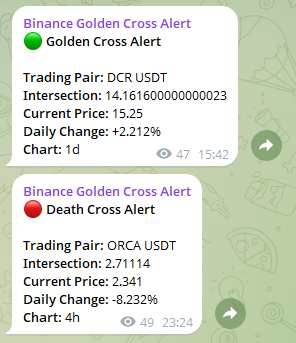
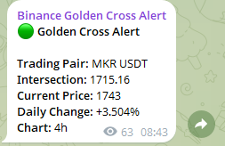
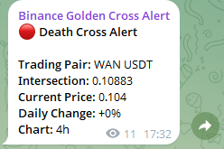

# Crypto Signal Bot: Automated Crypto Alerts on Telegram

**Crypto Signal Bot** is a Telegram bot that automatically monitors cryptocurrency price movements and shares trading signals using technical indicators like MA50 and MA200. Users receive alerts directly in a Telegram channel, helping them track market trends efficiently.

## How It Works

Crypto Signal Bot enables users to get real-time trading signals through a simple 2-step system:

1. Users send the **/status** command in Telegram to check the bot status.
2. Users click the **Start** button to begin signal detection or **Stop** to pause it. Detected signals are automatically analyzed and shared in the Telegram channel.

The bot continuously monitors **528 different coins** across multiple intervals to provide up-to-date alerts.

### Key Features

- **Telegram Bot Integration:** Fully functional within Telegram with inline buttons for control.
- **Automated Signal Detection:** Detects Golden Cross and Death Cross events in real-time.
- **Technical Analysis:** Uses MA50 and MA200 to determine market trends.
- **Deduplication:** Prevents duplicate signals from being shared.
- **User Access Control:** Only authorized users can operate the bot.
- **Error Recovery:** Automatic restart on errors ensures continuous monitoring.

## Visuals

Here are some screenshots of Crypto Signal Bot in action:

  
  
  
  

## Coming Soon...

- Multi-channel support for alerts
- Customizable alert thresholds
- Additional technical indicators (RSI, MACD, etc.)

---

> **Note:** This bot provides trading signals based on technical indicators and market data from Binance. It is for informational purposes only and is **not financial advice**. Users should verify signals before trading.
